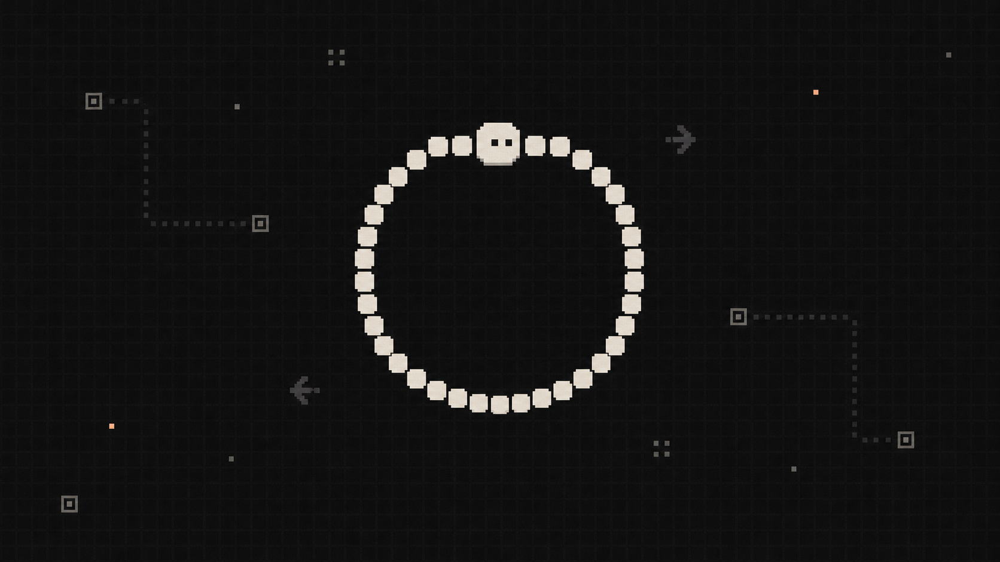

# Ouroboros



English · [简体中文](./zh_CN.md)

Loop Engineering for long-running coding-agent work.

Ouroboros turns a goal into planned tasks, isolated worktree sessions, verifier checks, repair loops, and reviewable artifacts. It is built for agent runs that last longer than a single prompt and need observable state, resumable execution, and a clear path from "work happened" to "this can be reviewed".

The project is called Ouroboros because its core pattern is a self-improving loop. The CLI is shortened to `orbs`.

## Why Ouroboros

Coding agents are good at doing focused work, but long-running work often fails around control:

- task state lives in prompts instead of durable storage
- workers run in the same directory and step on each other
- verifier criteria drift while execution is already underway
- retries repeat the same failure
- logs are too raw for humans to understand
- finished worktrees are hard to integrate safely

Ouroboros keeps the control plane local and explicit:

- SQLite stores runs, tasks, attempts, sessions, lessons, artifacts, and external refs.
- Planner tasks create a task graph.
- Worker tasks run in resumable sessions, usually in separate git worktrees.
- Verifier tasks check evidence against a contract.
- Repair tasks continue from verifier failures without redefining success.
- Integrator tasks collect verified work into reviewable output.
- Dashboard shows the live run, sessions, todos, changed files, diffs, and runner state.

```text
goal
  -> planner task graph
  -> worker sessions in worktrees
  -> verifier evidence
  -> repair loop
  -> integrator / proposed artifact
  -> goal review
```

## Status

Ouroboros is early, but it already has the core loop needed for self-iteration:

- SQLite-backed harness
- prompt templates stored in the database
- role-scoped stop hooks
- resumable Codex executor
- acpx/Codex executor foundation
- configurable ACP/acpx agent backend selection per role or task
- git worktree start hook
- dashboard with task graph, flow view, sessions, todos, changed files, and diff inspection
- Linear mapping skeleton
- self-iteration command

Active areas:

- integrator stage for merging verified worktree output into a reviewable patch, branch, or PR
- smoke-tested agent-specific adapters beyond the generic ACP/acpx backend foundation
- persistent dashboard history loaded from the database
- conversation view that turns raw stdout into a readable coding-agent stream

## Install

Development:

```bash
bun install
bun link
orbs init
```

Before linking, the repo-local fallback is still available as `bun run orbs -- <command>`.

Distribution target:

```bash
brew install orbs
orbs init
```

## Quick Start

Initialize the local database:

```bash
orbs init
```

Create a self-iteration run:

```bash
orbs self-iterate
```

Launch the dashboard and background runner:

```bash
orbs self-iterate-launch \
  --parallel auto \
  --worktree-root .ouroboros/worktrees \
  --start-hook git-worktree
```

Open:

```text
http://localhost:7331
```

Create a project-scoped run manually:

```bash
orbs create-project --name "Ouroboros" --root-path "$(pwd)"
orbs create-run --goal "Use Ouroboros to improve this repository" --project-root "$(pwd)"
```

Create a planner task:

```bash
orbs create-task \
  --run-id <run_id> \
  --role planner \
  --goal "Plan next step" \
  --prompt "Inspect the repo and propose the smallest useful task graph."
```

Run the loop:

```bash
orbs run-loop \
  --run-id <run_id> \
  --executor codex-resumable \
  --cwd "$(pwd)" \
  --sandbox workspace-write \
  --timeout-ms 1800000 \
  --idle-timeout-ms 300000 \
  --stop-hook create-tasks,create-verifier,create-repair,context-summary \
  --tasks auto \
  --worktree-root .ouroboros/worktrees \
  --start-hook git-worktree \
  --max-rounds 8
```

## Configuration

Ouroboros uses local TOML config plus environment variables. Do not commit real tokens.

```bash
cp ouroboros.example.toml ouroboros.toml
```

Linear example:

```toml
[linear]
project_url = "https://linear.app/<workspace>/project/<project>/overview"
team_key = "<team-key>"
token_file = ".linear"
```

Environment override:

```bash
LINEAR_API_KEY=lin_api_... orbs linear-check --run-id <run_id>
```

Model preference can live on the run or on a single task:

```bash
orbs create-run \
  --goal "Use Ouroboros to iterate on Ouroboros" \
  --context-json '{"modelDefaults":{"roles":{"worker":{"model":"gpt-5.4-mini"},"verifier":{"model":"gpt-5.5"}}}}'
```

```bash
orbs create-task \
  --run-id <run_id> \
  --role worker \
  --goal "Cheap implementation pass" \
  --prompt "Implement the scoped change." \
  --config-json '{"modelPreference":{"model":"gpt-5.4-mini","reason":"low-risk worker"}}'
```

Resolution order:

```text
task.config.modelPreference
then run.context.modelDefaults.roles[task.role]
then run.context.modelDefaults.global
then CLI --model
```

Agent backend selection can also live on the run or on a single task:

```bash
orbs create-run \
  --goal "Use Ouroboros to iterate on Ouroboros" \
  --context-json '{"agentDefaults":{"global":"claude-code","roles":{"verifier":"codex-resumable"}},"agentBackends":{"claude-code":{"kind":"acpx","agent":"claude","approval":"approve-all"},"codex-resumable":{"kind":"codex-resumable"}}}'
```

```bash
orbs create-task \
  --run-id <run_id> \
  --role worker \
  --goal "Run through Claude Code" \
  --prompt "Implement the scoped change." \
  --config-json '{"agentBackend":"claude-code"}'
```

See `docs/agent-backends.md` for capability boundaries, smoke testing, and custom `agentCommand` examples for ACP servers such as Hermes or Reasonix.

Claude Code uses its local Claude configuration by default. When a route resolves to `claude-code`, Orbs drops inherited `modelDefaults` and CLI `--model` values, including inert metadata such as `base_url` and `env_key`. A task can still set an explicit `config.modelPreference` when the Claude adapter should receive a specific `--model`.

### Self-Iteration Backend Default

Self-iteration runs keep `planner`, `verifier`, and `goal-review` on `codex-resumable` by default, with `claude-code`/acpx still available for `worker` and as `agentDefaults.global`. This recovered policy was added after a real self-iteration run observed a `claude-code`/acpx planner attempt stay running for more than 13 minutes with zero attempt events, zero output, and no worktree changes (see `docs/self-iteration-plan.md` for the full reason and inspection commands). Configure it through `ouroboros.toml`:

```toml
[agentDefaults]
global = "claude-code"

[agentDefaults.roles]
planner = "codex-resumable"
verifier = "codex-resumable"
goal-review = "codex-resumable"

["agentBackends"."claude-code"]
kind = "acpx"
agent = "claude"
approval = "approve-all"

["agentBackends"."codex-resumable"]
kind = "codex-resumable"
```

Inspect future self-iteration run evidence with:

```bash
orbs run-overview --run-id <run_id>   # confirms agentDefaults.roles and latest attempts
orbs list-lessons --run-id <run_id>   # confirms no new silent-start lesson was recorded
```

## Common Commands

```bash
# observability
orbs run-overview --run-id <run_id>
orbs dashboard --run-id <run_id> --port 7331

# task execution
orbs next-task --run-id <run_id>
orbs run-next --run-id <run_id> --executor noop --limit 2
orbs run-next --run-id <run_id> --executor codex-cli --cwd "$(pwd)" --sandbox read-only
orbs run-loop --run-id <run_id> --executor codex-resumable --cwd "$(pwd)"

# agent readiness
orbs doctor-agent --agent claude-code
bun run scripts/acpx-agent-smoke.ts claude-code

# resumable Codex
orbs codex-start-attempt --task-id <task_id> --cwd "$(pwd)"
orbs list-running-attempts --run-id <run_id>
orbs codex-resume-attempt --attempt-id <attempt_id> --cwd "$(pwd)"

# manual attempt control
orbs start-attempt --task-id <task_id> --input-json '{}'
orbs finish-attempt --attempt-id <attempt_id> --output-json '{"status":"done","summary":"..."}'
orbs retry-task --task-id <task_id>

# prompt templates and lessons
orbs list-lessons --run-id <run_id>
orbs show-task-prompt --task-id <task_id>
orbs show-prompt-template --key task
orbs set-prompt-template --key task --content "# Custom template..."

# Linear bridge
orbs linear-link-issue --local-type run --local-id <run_id> --issue-key LIN-123
orbs linear-link-issue --local-type task --local-id <task_id> --issue-url https://linear.app/<workspace>/issue/LIN-123/title
orbs linear-ingest-event --event-type issue.created --external-id LIN-123 --payload-json '{"action":"create"}'
```

## Roles

| Role | Responsibility |
| --- | --- |
| `planner` | Reads the goal, constraints, and prior lessons; creates an executable task graph. |
| `worker` | Implements one scoped task in its own session and, usually, its own worktree. |
| `verifier` | Checks evidence through tests, commands, diff review, browser checks, or contract-specific criteria. |
| `repair` | Fixes verifier failures while preserving the original success contract. |
| `goal-review` | Runs when the queue is empty and decides whether the original goal is complete. |
| `integrator` | Planned stage that turns verified worktree output into reviewable integration output. |

## Dashboard

The dashboard is the live control surface for a run. It should make these questions easy to answer:

- What is the current goal?
- Which tasks are running, done, blocked, or waiting for repair?
- What are the planner, worker, verifier, and integrator sessions doing?
- Which files changed?
- What evidence did the verifier produce?
- Is the runner still active, resumable, or stopped?

Start it with:

```bash
orbs dashboard --run-id <run_id> --port 7331
```

Useful local APIs:

```text
GET /api/runs/<run_id>/overview
GET /api/runs/<run_id>/changed-files
GET /api/runs/<run_id>/diff?path=<tracked_path>
```

## Linear Bridge

Linear is the collaboration surface. GitHub is the code surface. The local Ouroboros database is the control plane.

Current bridge scope:

- `linear-check` validates Linear access and records the run-to-project reference.
- `linear-link-issue` maps a local run or task to an external Linear issue.
- `linear-ingest-event` records a Linear event payload into `inbox_events` with `provider linear` and `status todo`. This is intake only: it stores the raw event and does not interpret it, does not create or update runs or tasks, and does not write to `external_refs`.

Inbox intake and external refs are separate paths. `external_refs` records stable local-to-external anchors. `inbox_events` records incoming raw events. Linear events recorded through `linear-ingest-event` do not mutate task state directly; the harness consumes them later through a separate decision step.

Not implemented yet:

- automatic issue creation
- webhook/event listening (the listener that would feed `linear-ingest-event`)
- comment sync
- PR status sync

Those events should enter through the harness inbox so the local control loop can decide what they mean.

## Project Layout

```text
docs/protocol.md                 Minimal runtime protocol
docs/control-loop-contracts.md   Planning, verification, guardrails, and experience
docs/self-iteration-plan.md      Self-iteration seed plan
AGENTS.md                        Repo-level instructions for future agents
packages/harness/schema.sql      SQLite schema
packages/harness/src/            Harness library
packages/runner/src/             Prompt builder, executors, hooks
packages/cli/src/                CLI and dashboard
```

## Development

```bash
bun install
bun run typecheck
bun test
```

Focused checks:

```bash
bun test tests/dashboard.test.ts
bun test tests/harness.test.ts tests/runner.test.ts
```

## License

MIT, unless a future release says otherwise.
