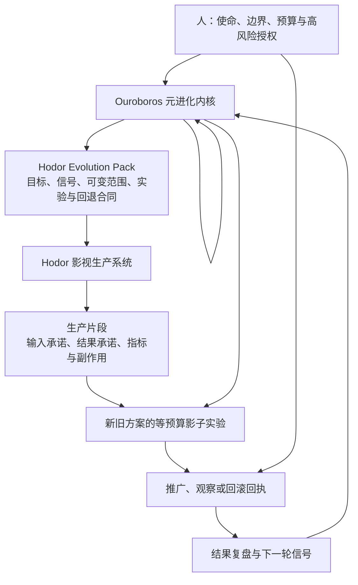

# Ouroboros × Hodor：让系统拥有持续改进自己的能力

> 面向产品使用者、合作伙伴和投资者的设计说明
> 当前阶段：Ouroboros 元进化平台持续运行；Hodor 自进化能力处于 `designed` 阶段

## 一句话说明

Ouroboros 是一套“帮助软件系统学会持续改进”的元系统。

它一方面用同一套方法改进自己，另一方面为 Hodor 这样的业务系统设计和安装自进化能力：持续观察真实使用结果，发现值得解决的问题，提出可以被证伪的改进方案，在受控环境中比较新旧方案，只让证据充分、风险可控的方案进入下一阶段，并保留完整的回退能力。

Hodor 是这套能力的首个业务参考。Hodor 面向影视生产，懂剧本、分镜、素材、生成流程和创作协作；Ouroboros 负责让这些业务能力形成可观察、可实验、可治理、可积累的学习闭环。

## 为什么需要一个“帮助其他系统进化的系统”

今天大多数智能软件都能完成任务，却很难证明自己会持续变好。

常见的改进方式依赖人工发现问题、人工写需求、人工组织开发、人工验收。模型可以加快其中某些步骤，但整体仍然是一次次项目制交付。每次修复结束后，问题为什么发生、方案为什么有效、对哪些场景有效、是否引入新风险，往往没有沉淀成下一轮可以直接使用的能力。

这会带来四个长期问题：

1. **改进速度受人工组织能力限制。** 团队需要反复收集反馈、整理上下文、拆任务和追进度。
2. **系统容易追着局部问题跑。** 测试失败会触发修复，却不一定形成对根因的理解。
3. **经验无法稳定复用。** 一个项目里有效的做法，很难被安全地迁移到另一个项目。
4. **自主性越高，风险越难管理。** 当系统可以修改代码、流程和策略时，错误也可能被快速放大。

Ouroboros 解决的是“改进能力本身”的产品问题。它把目标、证据、假设、实验、授权、交付、验收、推广、回滚和复盘组织成一套可重复运行的机制。产品因此可以从“等待人来改”逐步走向“持续发现机会、受控验证、积累有效能力”。

## 元自进化到底是什么

可以把普通智能系统理解成一个能工作的团队成员；把 Ouroboros 理解成这个团队背后的产品负责人、实验平台、质量体系和治理系统的组合。

它关心的重点包括：

- 系统应该朝什么方向变好；
- 真实问题和偶发噪声如何区分；
- 一项改动背后的因果假设是什么；
- 新方案怎样和旧方案公平比较；
- 哪些变化可以自动执行，哪些必须由人批准；
- 成功如何被证明，失败如何被限制和回退；
- 一次有效改进怎样沉淀为下一轮的起点；
- 某个项目的经验怎样在有证据时升级为通用能力。

“元”的含义在于：Ouroboros 的产品对象是其他系统的改进机制。它交付的不只是一项功能，还包括这个系统今后如何观察、学习、实验和治理的完整方法。

同时，Ouroboros 也把自己当成目标系统。它用自己的设计、执行、验证和复盘流程改进自身控制面。这样可以持续检验这套方法是否真的能够在真实工程中运行，也让每次控制面故障转化为新的约束、守卫和产品能力。

### 三种不同深度的改进

| 改进层次 | 改变什么 | 例子 | 当前范围 |
| --- | --- | --- | --- |
| 结果改进 | 某一次具体交付 | 修正一段代码、补一份分镜、修复一次任务 | 已广泛支持 |
| 工作系统改进 | 以后完成同类任务的方法 | 调整提示、工具、角色分工、记忆、评价方式和恢复流程 | Ouroboros 的重点 |
| 模型改进 | 模型权重和训练过程 | 训练或微调新的基础能力 | 当前不开放 |

修好一个测试属于结果改进。只有当系统说明重复失败的机制，改变后续工作方法，并在保留任务和无关任务上证明长期提升，才能算作工作系统层面的自进化。

这一区分直接影响产品价值。结果改进解决眼前问题；工作系统改进降低未来一整类问题的发生率和处理成本。Ouroboros 追求的是后者，同时保留结果改进作为落地手段。

## Ouroboros 与 Hodor 的关系

两者形成两个相互连接、职责分开的学习闭环。

### Ouroboros 负责什么

Ouroboros 提供一套跨项目可复用的进化内核：

- 读取使命、用户信号、运行证据和历史结果；
- 形成明确的改进假设，并列出可能推翻假设的证据；
- 定义候选方案能修改的范围和严禁触碰的范围；
- 把开发集、保留验证集和无关回归集隔离开；
- 保证新旧方案使用相同模型、时间、次数、工具和预算；
- 组织规划、实现、验证、修复、集成和结果复盘；
- 记录每个关键动作的来源、授权、文件、哈希和独立回读；
- 在失败、停滞或反复重试时收敛为明确终态；
- 把多次验证有效的项目经验提升为平台能力。

### Hodor 负责什么

Hodor 保留影视生产领域的判断力和执行能力：

- 理解剧本、场景、镜头、人物和素材之间的关系；
- 执行 ProductionGraph 中的生产动作，把场景、镜头、素材和生产过程组织成可追踪的关系图；
- 记录创作流程里的质量、成本、时延和人工修正；
- 提供能代表真实生产问题的样本；
- 定义影视生产中什么叫更好，以及什么风险不可接受；
- 在获得授权后应用经过验证的策略，并提供结果回读。

Ouroboros 不替 Hodor 决定艺术风格，也不把某个通用分数当成业务价值。Hodor 的领域目标来自自身使命和用户，Ouroboros 负责让改进过程可信、可控、可重复。

## 一个系统如何完成一次自我改进

完整周期包含九个步骤。

1. **人定义使命和边界。** 明确服务谁、创造什么价值、哪些目标不可牺牲、哪些事项需要人工批准。
2. **系统形成可观察信号。** 从真实运行、用户反馈、代码和业务指标中提取结构化证据，并标记时间、可信度和有效期。
3. **设计者提出因果假设。** 说明问题为什么发生、准备改变什么、预期哪些指标变化、什么结果会证明方向错误。
4. **授权层审查方案。** 检查证据、项目身份、成本、权限和风险。高风险或涉及资金的方案进入人工关口。
5. **冻结进化合同。** 把目标、可变范围、实验预算、验证方式、停止条件和回退要求固定下来，后续执行者不能自行修改标准。
6. **执行受限交付。** 规划者拆解任务，工作代理在隔离环境中修改，验证者依据证据检查，失败只允许有限修复。
7. **完成公平实验。** 候选方案和基线在开发集、保留验证集及无关回归集上使用同等资源比较，保留数据不会提前暴露给候选生成过程。
8. **推广、观察或回退。** 只有准确目标、授权决定、独立回读、观察窗口和回退计划同时成立，候选才可进入下一成熟度。
9. **结果回到下一轮。** 系统记录保留、修订或退役结论，把实际效果和意外影响转化为下一轮设计信号。

这套循环的关键价值在于，每次变化都带着原因、边界和结果。系统积累的是经过验证的决策能力，而非数量不断增加的代码修改。

## 人在系统中的角色

人在这套体系中拥有最终目的和关键风险的决定权。自动化越强，这个角色越需要被写清楚。

### 1. 使命制定者

人维护 Founder Charter，也就是系统的长期使命、价值指标、原则、禁止事项和资本政策。系统可以提出修改建议，但不能自行改写使命。

这是最重要的限制。缺少这一层，系统可能逐渐优化容易测量的指标，却偏离用户真正需要的结果。

### 2. 授权者

以下事项必须由人或明确配置的治理主体批准：

- 一次性或持续性花费；
- 真实供应商调用和生产发布；
- 数据分类、隐私和保留政策变化；
- 扩大可修改范围或跨项目读取信息；
- 模型训练、权重变化或新的高风险能力；
- 无法用现有合同覆盖的新型风险；
- 推广到真实用户以及不可逆操作。

零成本、低风险、边界清晰的技术和产品改进可以在既定授权内自动推进，但仍需要完整证据和独立验证。

### 3. 领域判断者

有些价值难以靠单一数字表达。影视内容的叙事节奏、镜头表达、角色一致性和创作体验，需要创作者和产品负责人参与定义评价标准，并处理指标冲突。

人的目标是提供高质量判断和价值取舍，系统负责把这些判断变成可复用合同，减少后续重复协调。

### 4. 审计者和紧急制动者

人可以查看每个提案、授权、实验、文件变化、验证结果、推广回执和回退记录，也可以暂停周期、收窄权限或退役某项能力。

系统必须保留可理解的失败原因，不能用内部成功状态代替真实结果，也不能通过无限重试制造“仍在进展”的表象。

### 人参与的关键时刻

| 时刻 | 人需要回答的问题 | 系统需要提供的证据 |
| --- | --- | --- |
| 启动一个目标系统 | 使命、用户和不可牺牲的边界是什么 | Founder Charter、项目身份、初始基线 |
| 批准高风险方案 | 收益是否值得承担成本与风险 | 因果假设、替代方案、预算、失败条件 |
| 开放真实数据 | 数据能否用于学习和验证 | 隐私政策、脱敏证明、保留期限、独立回执 |
| 从影子实验进入真实应用 | 候选是否在真实约束下持续优于基线 | 等预算结果、无关回归、观察窗口、精确目标 |
| 发生异常 | 继续、回退还是退役 | 当前状态回读、影响范围、最后已知良好版本 |
| 定期战略复盘 | 系统是否在改善真实用户价值 | 长期业务指标、意外影响、能力复用情况 |

## Ouroboros 如何自我迭代

Ouroboros 对自身运行同样的闭环。

它持续读取自己的任务状态、测试结果、集成回执、运行停滞、重复失败和结果复盘。Designer 先判断是否存在值得处理的信号；有证据时提出设计，没有足够依据时保持安静。被接受的设计进入受限交付，经过独立验证和精确集成后才进入效果观察。

当前已经具备的主要能力包括：

- 基于 SQLite 的可恢复运行状态，任务会话消失后仍可继续；
- Founder Charter、策略信号、设计提案、授权决定和结果复盘；
- Designer、Planner、Worker、Verifier、Goal Review、Outcome Review 分工；
- 冻结验证合同、有限修复预算和停止条件；
- 隔离工作树、精确 Git 提交/分支/推送及独立回读；
- Linear 状态和证据评论的受限写回；
- 停滞检测、进度指纹、冷却期和受控恢复；
- 运行时代际切换，让常驻进程加载已验证的新控制面代码；
- 只有验证过的集成收口后，设计提案才进入效果测量。

Ouroboros 的自我迭代仍然受人类使命、权限和成本政策约束。它可以完善自己的调度、验证和进化工具，但不能给自己增加无限权限，也不能自动把一次成功经验推广到所有项目。

## Ouroboros 如何帮助 Hodor 自我迭代

Ouroboros 为 Hodor 提供的核心产品是一个版本化的 Evolution Pack。它相当于 Hodor 的“学习说明书”，定义五类内容：

1. **观察什么。** 哪些生产结果、人工修正、成本和质量指标可以成为证据。
2. **允许改什么。** 哪些策略、流程、提示、工具或代码属于本轮可变范围。
3. **禁止改什么。** 生产数据、凭据、跨项目记忆、模型权重和未授权业务范围保持封闭。
4. **怎样证明更好。** 基线、候选、保留验证集、无关回归集和等预算标准。
5. **怎样进入下一阶段。** 所需回执、观察窗口、推广条件、失败结果和回退方案。

在运行层，Hodor 的一次进化将由五类记录串起来：

- **EvolutionProfile：** 本轮使用哪一版使命、进化包和可变范围；
- **ProductionEpisode：** 一次真实生产经历的输入承诺、结果承诺、指标和副作用；
- **HarnessVariant：** 旧方案与新方案的准确版本；
- **MatchedExperiment：** 两个方案在隔离数据和同等预算下的比较；
- **Promotion / Rollback Receipt：** 最终应用、观察和回退的事实证明。

例如，Hodor 可以针对“空间风险判断导致过多人工返工”提出一个候选策略。系统先在开发样本上形成方案，再用未提前暴露的镜头集合验证，同时检查无关类型的镜头是否退化。候选若达到提升门槛、守卫指标没有恶化、成本和外部副作用为零，才有资格申请进入更高成熟度。进入真实生产还需要人的授权、准确版本、独立回读、观察窗口和可执行回退方案。

### 从 Hodor 使用者的角度看

假设一个制作团队发现，复杂场景里的镜头空间关系经常需要人工返工。

过去，团队可能提交一条需求，等待开发修改规则，然后凭少量案例判断是否有效。接入完整自进化能力后，体验会变成：

1. Hodor 自动汇总经过隐私处理的返工事件，展示影响范围和成本；
2. Ouroboros 判断它是否构成稳定信号，并提出一个可解释的原因和候选策略；
3. 产品负责人看到旧方案、新方案、预期收益、风险、预算和失败条件；
4. 系统在不触碰真实生产的环境中完成公平比较；
5. 结果页面同时展示质量提升、无关场景回归、副作用和可信度；
6. 人决定是否进入真实观察，系统负责准确应用、持续监控和准备回退；
7. 观察期结束后，团队看到的是“保留、修订或退役”的业务结论，而不只是测试通过。

对使用者来说，自进化的直接感受是：产品会根据真实工作持续改善，同时每次改善都能解释、能控制、能撤回。

## 当前进展：已经完成、受限可用、尚未开放

| 能力 | 当前状态 | 说明 |
| --- | --- | --- |
| Ouroboros 自我设计与交付闭环 | **已运行** | 能从信号形成设计，经授权、交付、验证、集成和结果复盘推进自身改进 |
| 项目身份与知识隔离 | **已实现** | Ouroboros 内核、Hodor 项目和具体交付运行拥有独立身份，跨项目引用会被拒绝 |
| Hodor Evolution Pack | **已设计并可解析** | 目标、观察、可变范围、因果假设、实验和成熟度合同已有机器可读参考 |
| 五类交付合同 | **已冻结** | 样本采集、成熟度门、隐私要求、推广要求和回退要求会完整进入子运行 |
| EvolutionProfile 与 HarnessVariant | **受限可用** | 可以登记声明和候选版本，并做不可变回读；这只证明身份与边界 |
| ProductionEpisode | **设计与存储结构已具备，公开写入关闭** | 需要宿主侧不可伪造的隐私审查回执后才会开放真实样本采集 |
| MatchedExperiment | **结构已具备，执行链未开放** | 缺少可信生产样本和隔离实验执行器，当前只能冻结未来规范 |
| 推广、观察和回滚 | **尚未开放** | 草案结构已存在，真实动作、独立回读和回滚执行仍待实现 |
| Hodor 自主提出并推广改进 | **尚未开放** | 当前成熟度为 `designed`，不能声称已经进入自主运行 |
| 跨项目经验升级为平台能力 | **规则已设计，运行能力待建** | Hodor 的经验默认留在 Hodor；需要多项目证据才能进入内核 |

当前机器可读参考见 [Hodor Evolution Pack v0](examples/hodor-evolution-pack-v0.json)，技术边界见 [Target-System Evolution](target-system-evolution.md)，控制循环见 [Control Loops and Contracts](control-loop-contracts.md)。

## 为什么早期会反复围绕测试修复

测试是必要的安全门，但测试本身不会告诉系统应该朝哪里进化。

早期 Ouroboros 更擅长发现“哪里坏了”，还不够擅长区分环境故障、控制面故障、合同缺口、代理能力不足、评价缺陷和真实业务假设失败。结果是系统容易根据最近一次失败安排下一次工作，形成局部修复密集、长期能力增长不够清晰的问题。

元进化设计正在把重心移到三个更上游的问题：

- **有没有明确的因果假设。** 每个候选都要说明为什么会改善结果，以及什么证据会推翻它。
- **有没有公平的比较。** 新方案必须在隔离数据和相同资源下与基线比较。
- **有没有真实结果闭环。** 代码通过测试后仍需完成集成、业务观察和结果复盘，才能被称为有效改进。

因此，未来测试主要证明边界和合同没有被破坏；产品是否真的进步，需要由真实业务指标、保留验证集、无关回归和长期结果共同证明。

## 对产品使用者的收益

### 更少的重复协调

用户不需要为每个问题重新组织完整项目流程。系统可以自动汇总上下文、提出有证据的方案、拆解交付并生成验收材料。人把时间放在使命、创意判断和关键取舍上。

### 更可靠的持续改善

每次改进都有基线、候选、预算、证据和回退。产品团队可以知道某项能力为什么上线、适合哪些场景、何时应该退役。

### 个性化能力会随使用积累

Hodor 可以从具体团队的创作流程中学习哪些策略减少返工、哪些分镜规则更有效、哪些素材复用方式更省成本，同时保持项目数据和知识边界。

### 自主性带来的风险可见

用户可以看到系统正在改什么、依据是什么、花费多少、是否触碰真实生产、失败后如何恢复。自主运行由可审计行动组成，不依赖模糊的“代理会自行处理”。

## 对投资者和长期产品战略的收益

### 1. 从功能复利转向改进能力复利

普通产品的增长来自持续增加功能。元进化产品还会积累“怎样让功能更有效”的能力。每个项目产生的高质量假设、实验方法、守卫规则和回退经验，都可能降低后续改进成本。

### 2. 形成可复用的平台层

Ouroboros 的内核可以服务多个目标系统；每个系统通过自己的 Evolution Pack 保留领域差异。平台研发投入可以被多项目复用，领域产品又不会被强行塞进同一套业务逻辑。

### 3. 提升自主系统的可投资性

真正影响企业采用自主系统的因素包括可控性、审计性、数据边界和失败恢复。Ouroboros 把这些要求放在架构核心，有机会把“代理演示”推进为可长期运营的生产系统。

### 4. 建立更难复制的数据与治理资产

长期壁垒来自经过授权的生产片段、候选版本、实验结果、失败样本、回退记录和适用边界。单独的模型或提示很容易替换，这套持续积累的因果证据和治理历史更贴近真实业务。

### 5. 改善单位价值成本

成熟后可以用更少人工协调完成更多有效改进，并通过素材复用、策略优化、失败预防和等预算实验降低浪费。收益应以真实业务指标衡量，包括返工率、交付周期、创作者接受率、单个有效镜头成本和异常恢复时间。

## 产品形态

这套能力可以形成四层产品：

1. **Evolution Kernel：** 通用的设计、授权、实验、交付、验证和治理平台；
2. **Project Evolution Pack：** 面向某个业务系统的进化协议和成熟度路线；
3. **Domain Adapters：** 把真实业务事件、指标和执行动作接入进化闭环；
4. **Governance Console：** 面向人提供目标、预算、风险、实验、推广和回退的控制界面。

Hodor 是第一个领域包。未来同样的方法可以用于研发代理、内容平台、运营系统或其他长期运行的软件，只要每个系统都能明确目标、证据、可变范围和安全边界。

## 未来路线

### 阶段一：接通可信观察

- 建立宿主侧不可伪造的 ProductionEpisode 隐私回执；
- 把 Hodor 的真实生产经历转为内容承诺、指标和副作用记录；
- 建立数据分类、脱敏、保留期限和删除审计；
- 让普通工作代理只能看到开发数据和保留集承诺。

完成后，Hodor 才能从 `designed` 进入 `instrumented`。

### 阶段二：运行零副作用影子实验

- 实现隔离的候选执行器；
- 对基线与候选使用相同模型、时间、次数、工具和预算；
- 分别评估开发集、保留验证集和无关回归集；
- 独立证明没有真实供应商调用、生产写入、付费生成和跨项目读取。

完成后，Hodor 才能进入 `shadowing`。

### 阶段三：建立受监督推广与回退

- 生成绑定准确版本和授权决定的推广回执；
- 在真实应用前进行准确目标回读；
- 运行受限观察窗口和守卫指标；
- 在异常时恢复到最后已知良好版本，并独立确认结果。

这一阶段仍保留人工批准。系统可以准备全部证据和动作，人决定是否进入真实生产。

### 阶段四：开放目标系统的受限自主进化

Hodor 可以在自身 Charter 和 Evolution Pack 内主动提出候选、运行影子实验、申请推广，并根据结果保留、修订或退役策略。它仍然不能修改使命、扩大权限或跳过人工关口。

### 阶段五：形成跨系统的元学习

当同一种方法在多个项目、多个数据集和多个周期中都有效时，Ouroboros 可以提出把它升级为内核能力。迁移需要新的提案和证据，不能直接把 Hodor 的局部经验当作普遍规律。

## 如何衡量这项事业是否成功

需要同时看平台、目标系统和治理三组指标。

### Ouroboros 平台指标

- 从有效信号到验证结果的周期；
- 重复根因的复发率；
- 有限修复后能够明确收敛的比例；
- 候选在保留集和无关回归集上的真实提升；
- 项目经验被多项目验证并升级为通用能力的比例。

### Hodor 业务指标

- 创作者接受率和人工改写率；
- 从剧本到可用镜头的交付周期；
- 分镜、角色、空间和素材的一致性；
- 单个有效结果的成本；
- 失败、回退和异常恢复时间；
- 新策略在不同题材、团队和项目中的稳定性。

### 治理指标

- 未授权花费和生产变更必须为零；
- 保留验证信息泄露必须为零；
- 每次推广都能找到授权、准确目标、独立回读和回退证据；
- 系统停止、退役和人工接管路径始终可用。

## 必须长期坚持的限制

- 系统不能修改自己或目标系统的 Founder Charter；
- 系统不能自行批准花费、生产发布、真实数据开放或权限扩大；
- 系统不能把模型自评、单次测试或历史响应当成独立证据；
- 系统不能提前查看保留验证集的内容或结果；
- 系统不能通过无限重试维持“仍在工作”的状态；
- 系统不能执行任意数据库写入、任意网络访问或任意远端操作；
- 系统不能把 Hodor 的项目知识自动带入其他项目；
- 系统不能在缺少准确回读、观察窗口和回退能力时推广候选；
- 模型权重训练不在当前授权范围内。

这些限制并不会削弱产品价值。它们决定了系统可以在真实业务里运行多久、覆盖多大范围，以及用户愿意交给它多少责任。

## 未来展望

Ouroboros 的长期目标，是成为智能软件的持续进化基础设施。

未来的软件不会只在发布新版本时变好。它会持续观察自己的表现，理解差距，提出可验证的改进，在安全边界内学习，并把有效经验沉淀为新的工作能力。不同系统拥有不同使命、数据和领域判断，但可以共享同一套严谨的进化方法。

在这个关系中，Ouroboros 提供改进的制度和工具，Hodor 提供影视生产的真实世界与领域价值，人提供目的、边界和最终责任。三者共同形成的产品，才有机会让自主系统同时获得学习速度、业务效果和长期可信度。
